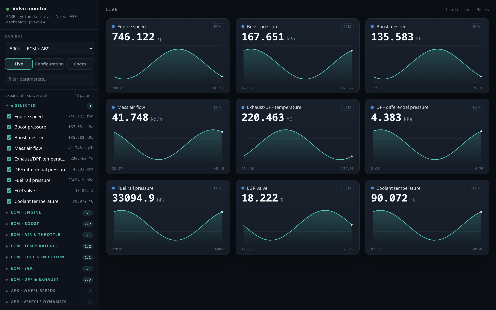

# Volvo Diagnostic Toolkit

[](https://github.com/MarvinParanoid/VolvoDiagToolkit/actions/workflows/tests.yml)

> Unofficial and independent. Not affiliated with, authorised by or endorsed by
> Volvo Car Corporation. "Volvo" and "VIDA" are their trademarks and appear here
> only to describe what this software talks to.

Read a Volvo's real parameters — live, in a browser dashboard — without VIDA.
Built around a Volvo V50 (P1) with the D4164T 1.6 diesel; the engine-specific
part is data files, the rest is not Volvo-specific.

The target is the DPF/diesel picture that VIDA shows and generic OBD does not:
actual and requested boost, DPF differential pressure, exhaust temperature, EGR,
rail pressure. This ECM does not answer the legislated OBD stack — it is reached
over raw 29-bit CAN with Volvo's own framing, reverse-engineered from real VIDA
sessions through a logging proxy and cross-checked against VIDA's own database.


<!-- screenshot not committed yet — run `serve --fake` and drop one in; see docs/images/ -->

## Quick start

No car, no adapter — the whole dashboard on synthetic data:

```sh
pip install pyyaml
PYTHONPATH=python python3 -m volvo_diag serve --fake
# open http://127.0.0.1:8080/
```

On the car (Windows + a VXDIAG J2534 adapter; 32-bit Python for a 32-bit driver):

```powershell
$env:PYTHONPATH="python"
python -m volvo_diag devices                    # find the driver
python -m volvo_diag serve --host 127.0.0.1 --port 8080
```

Full command list and what the dashboard does: **[docs/dashboard.md](docs/dashboard.md)**.

## Supported vehicles

| vehicle | modules read | state |
| --- | --- | --- |
| Volvo V50 (P1), D4164T 1.6D, 2007 | ECM, ABS, CEM, DIM + CEM car configuration | the reference car |
| Other P1 (S40 / C30 / C70), other engines | — | data-only; extract its variants from CarCom (see below) |

The transports, protocol and dashboard are not car-specific; only the parameter
definitions are. Adding a car is a data exercise —
[docs/adding-vehicle.md](docs/adding-vehicle.md).

## Hardware (adapters)

| adapter | transport | Windows | Linux | Android | status |
| --- | --- | :---: | :---: | :---: | --- |
| VXDIAG VCX (SE / NANO) | J2534 | ✅ | — | — | **verified on the car** |
| CANable / any SocketCAN | SocketCAN | — | ✅ | via USB | code exists, untested on the car |
| vLinker MC (ELM327) | ELM327 | ✅ | ✅ | Bluetooth | code exists, untested on the car |

VXDIAG is the reference path: its vendor J2534 DLL is Windows-only, so the client
runs on Windows (a modern Windows 10 is fine — it does not have to be the VIDA
machine). SocketCAN and ELM327 are wired but not yet confirmed against a real
car; details in [docs/adding-vehicle.md](docs/adding-vehicle.md#transports-and-buses).

## Documentation

| doc | what |
| --- | --- |
| [dashboard.md](docs/dashboard.md) | the reading client and dashboard — commands, buses, config, backups |
| [install-windows.md](docs/install-windows.md) | the reading client and the VIDA machine (incl. Windows 7 SP1) |
| [install-linux.md](docs/install-linux.md) | build and try everything on Linux against the fake driver |
| [vida-proxy.md](docs/vida-proxy.md) | the logging proxy: register it, prove it, the log format |
| [adding-vehicle.md](docs/adding-vehicle.md) | filling the parameter database (proxy logs + CarCom), status ladder |
| [carcom.md](docs/carcom.md) | extracting definitions from VIDA's SQL database |
| [volvo-protocol.md](docs/volvo-protocol.md) · [method.md](docs/method.md) | the on-wire A6/B9 protocol · how a single parameter is found |
| [troubleshooting.md](docs/troubleshooting.md) | adapter, VM bridging, Windows 7 Python install, common errors |

Repository layout: [`proxy/`](proxy/) the J2534 logging DLL · [`fake-j2534/`](fake-j2534/)
a simulated ECM · [`test-client/`](test-client/) a minimal J2534 app ·
[`python/volvo_diag/`](python/volvo_diag/) the protocol, transports, dashboard,
config decode · [`definitions/`](definitions/) the YAML databases ·
[`scripts/`](scripts/) build/registration and the `carcom-*.ps1` extractors.

## Scope

Read-only, deliberately. No security access, no writing identifiers, no routine
control, no clearing adaptations, no forced regeneration. The proxy will show you
how VIDA does all of those; that is not a reason to do them from a half-verified
parameter database. (Why config *writes* in particular are gated — a per-car
CEM PIN not in CarCom — is in the [references](docs/adding-vehicle.md) and
[vtl/volvo-cem-cracker](https://github.com/vtl/volvo-cem-cracker).)

## Licence and disclaimer

[MIT](LICENSE).

Unofficial and independent: no affiliation with Volvo Car Corporation, and the
trademarks are theirs.

This software talks to the diagnostic bus of a moving vehicle's engine
controller. It only reads, and it goes out of its way to say which of its numbers
are guesses — but it comes with no warranty of any kind, and a diagnostic tool
that is wrong about a DPF is a tool that can cost you an expensive part. Verify
against VIDA before you act on anything it tells you, and do not use it while
driving.
