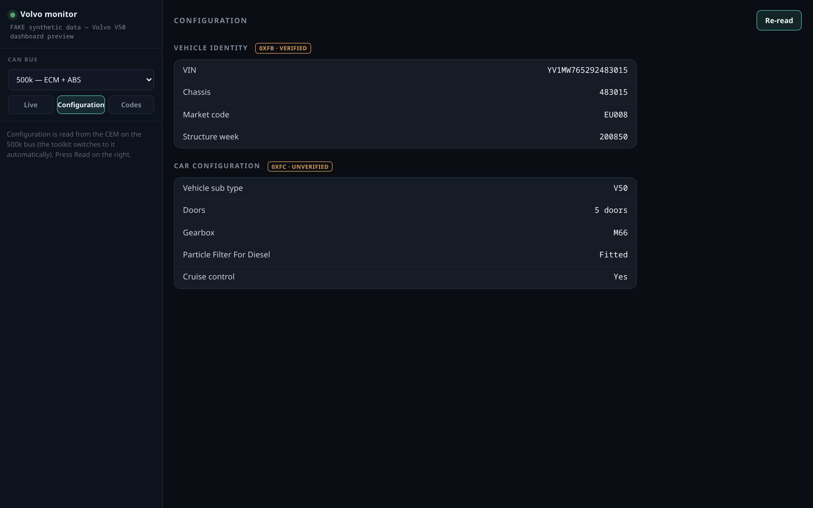
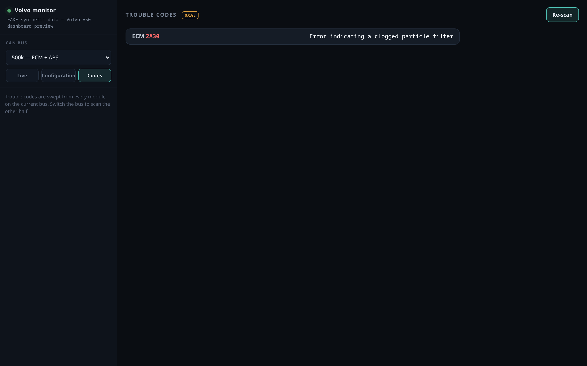

# The dashboard and the reading client

The reading client is pure Python plus PyYAML and does **not** need the Windows 7
VIDA machine — it only needs the VXDIAG J2534 driver and access to the adapter,
so a modern Windows 10 box works well. Match Python's bitness to the driver's
(32-bit VXDIAG DLL → 32-bit Python). Install it (`pip install -e .` gives the
`volvo-monitor` command) or run straight from a checkout with `PYTHONPATH=python`.

## Commands

```powershell
$env:PYTHONPATH="python"
python -m volvo_diag devices                      # find the registered J2534 driver
python -m volvo_diag read coolant_temperature     # one value, quick sanity check
python -m volvo_diag monitor                       # live table in the terminal
python -m volvo_diag serve --host 127.0.0.1 --port 8080   # the dashboard
python -m volvo_diag config                        # CEM identity + car configuration
python -m volvo_diag dump --ecu CEM                # back up a module's blocks to JSON
python -m volvo_diag read 22F190                   # raw UDS request, any hex
```

No adapter to hand? `serve --fake` runs the whole dashboard on synthetic data
over the real definitions:

```sh
PYTHONPATH=python python3 -m volvo_diag serve --fake
```

## The dashboard (`serve`)

The main way to watch the car. A sidebar lists every defined parameter grouped
by *Module · Subsystem*, with:

- **search** to filter the list,
- collapsible groups and a pinned **Selected** section,
- **live charts** — tick a parameter and it draws a proper time-series graph,
- a **bus selector** switching between the 500k powertrain bus (ECM, ABS, CEM)
  and the 125k low-speed cabin bus (DIM and the other cabin modules); a CAN link
  is one baud rate, so they are read one at a time,
- a **Configuration** tab that reads the CEM's vehicle identity (VIN, chassis,
  market) and the ~99 coded car-config options (gearbox, doors, particle
  filter, …). The CEM answers these blocks on the 500k bus only, so the tab
  switches to it automatically and restores your bus afterwards,
- a **Codes** tab that sweeps every module on the current bus for active trouble
  codes (service 0xAE) and names each from the catalogue; switch the bus to scan
  the other half. It can also **clear** codes (service `AF 11`) — the one
  supported write: only when `serve` is started with `--enable-writes`, behind a
  confirm, and the codes are re-read afterwards to verify.

Open it in the guest's browser, or reach it from the host over the network with
`--host 0.0.0.0`.





Every row carries a status colour — `verified-against-vida` down to `candidate`
— so it is never unclear which numbers are trusted and which are still guesses.

**Polling.** The page reads the selected parameters on the single adapter thread,
so it paces itself: the next `/data` is scheduled only after the previous one
returns (requests can never queue up and lag behind), no more often than
`--interval` (default 0.2 s). Trusted ids get a tight read timeout (0.1 s) so a
miss is cheap; unconfirmed `candidate` ids drop to a slow lane (about one every
3 s) so an unreadable DID can't stall the live values; an id that keeps missing
backs off further. The header shows the live cycle time, rate, and any timeouts,
and stale values dim until they refresh. For the liveliest boost/RPM, select a
small set and pass `--interval 0.1`.

The whole page is single-threaded ES5 + `XMLHttpRequest`, self-contained, and
renders in the old browser on a Windows 7 guest as well as a modern one.

## Backups (`dump`)

`dump` reads a module's identity/configuration blocks (VIN, car configuration,
part numbers) and writes them to a JSON file verbatim — a reference backup: to
compare against later (`diff`), or to support manual recovery with a proper
programming tool. The toolkit is read-only and cannot itself restore a module
from the JSON — it only records what the module held.

```powershell
python -m volvo_diag dump --ecu CEM                 # default blocks FB, FC, F5
python -m volvo_diag dump --ecu CEM --blocks FB,FC,F5,C010
python -m volvo_diag dump --group 54                # a module with no definition
```

It reads on the current bus — inferred from `--ecu`, or forced with `--bus hs`
(500k: ECM/ABS/CEM) / `--bus ls` (125k low-speed: DIM and the cabin modules).

Compare two dumps to see exactly what changed — the read-only way to check a
change before/after:

```powershell
python -m volvo_diag dump --ecu CEM --out before.json
# … change something in VIDA …
python -m volvo_diag dump --ecu CEM --out after.json
python -m volvo_diag diff before.json after.json
```

`diff` prints the changed bytes and, for the identity/config blocks, which
decoded field or option moved (e.g. `Gearbox: MTX75 -> M66`). See
[config.md](config.md) for the block layout and the checksum.

## Trip recording and analysis

Record a drive to a CSV, then get a diesel/DPF report from it:

```powershell
python -m volvo_diag record trip.csv                 # ctrl-c to stop; diesel/DPF preset
python -m volvo_diag record trip.csv --params rpm,boost_actual,boost_requested,exhaust_temperature
python -m volvo_diag analyze trip.csv                 # text report
python -m volvo_diag analyze trip.csv --html report.html   # + charts
```

`analyze` matches the recorded columns to roles (boost actual/requested, exhaust
/ DPF temperature, DPF pressure, MAF, RPM, coolant) and reports: per-parameter
min/max/mean/last, warm-up time (to 70 °C / 88 °C), boost tracking error (max and
mean deviation of actual vs requested), and **probable regeneration** windows —
from the `regeneration_active` flag if recorded, else sustained high exhaust
temperature. `--html` writes a self-contained page with the charts (regen windows
shaded).

